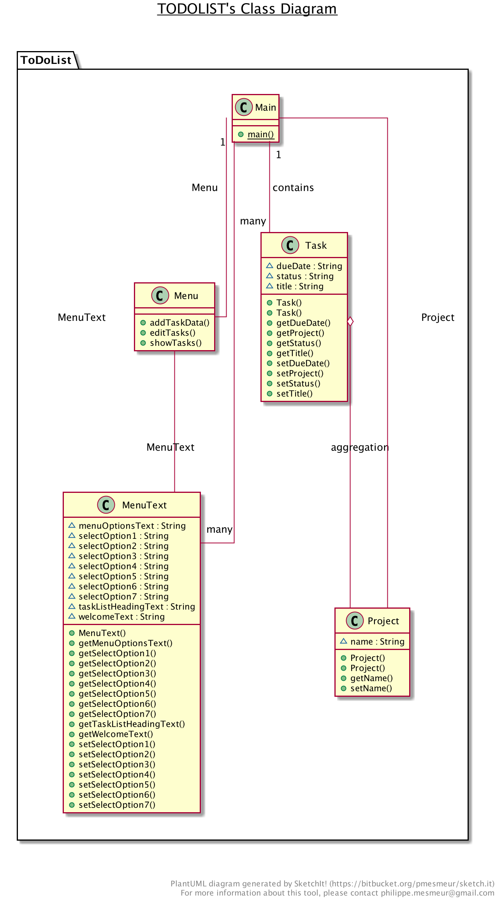
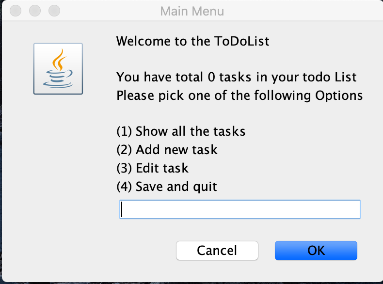

# SDA-Personal-Project

-----

## Title : Basic Java GUI TODO List Application 

### Specification: 

This is a basic ToDo List GUI application using the Java Swing Library that will allow a user to create new tasks, assign 
a title and due date, Status, and name the project that task belong to. They will need to use a text based GUI interface 
via will use the alert message window. The user should be able to also edit name, due date, change the status or Project 
name task belong to or remove the tasks. They can also quit and save the current task list to file, and currently then 
restart the application need to add the new date each time and in order to achieve the  former state restored some small 
modification is required. User can see the count of the total number of Tasks as well. User will have repeat some process 
option available as well also will check the validity of the input for some options as well.  

### Requirement List: 

1.  User see all Display Menu to choose actions for tasks. 
2.  User can See count of total tasks. 
3.  User can see the all tasks or message if there are not tasks.
4.  User can get error message and to choose again in case of selecting the option which don't exist.
5.  User can add new Tasks (title, due date, status, Project).
6.  User can repeat the add option after adding one task.
7.  User can see the the tasks and details after adding.
8.  User can Edit the Tasks (title, due date, status, Project). 
9.  User can get message when there are no tasks to edit.  
10. User can select which tasks to edit. 
11. User can get error message while selecting to edit the task number which don't exist. 
12. User can repeat the edit option after adding one task. 
13. User can Delete the Task.
14. User can save the tasks to the file.
15. User can quit the program without adding any task.
16. User can choose to reopen the main Display before quoting the application.

## Class Diagram 

       
   
  

## User Interface mockup:

 
 
 
 ## User Guide
 
 1. Start the application using the some IDE or Main Class. 
 2. Option will be display choose one of the options from show, add, edit, save and quit). 
 3. write 1 for showing the tasks but first time or if there are no tasks will display message that there is no task and will choose display tasks if added before showing.   
 4. Write 2 for adding the task (title, due date, status, Project).
 5. Write 3 for editing the task (title, due date, status, Project) will ask to add the task in case there is no task to edit. 
 6. Write 4 for saving to file and quit the task. (Will still ask user if he want to view display again before quiting).
 7. Error messages will be displayed for some options in case of wrong entry while asking to write again.  
 8. Repeat Option will be displayed while asking to see some display again. 
 
 
 
  
 
 